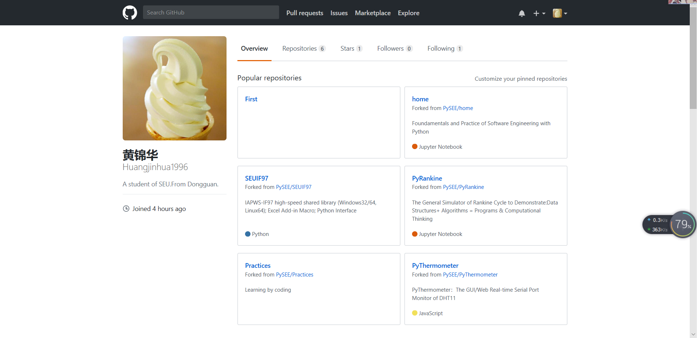

# 软件工程作业-1

03015310 黄锦华

## 一、个人Git账户

1.账户名：Huangjinhua1996

2.使用的电子信箱：q1415001536@qq.com

## 二、Github简介

gitHub是一个面向开源及私有软件项目的托管平台，因为只支持git 作为唯一的版本库格式进行托管，故名gitHub。gitHub于2008年4月10日正式上线，除了git代码仓库托管及基本的 Web管理界面以外，还提供了订阅、讨论组、文本渲染、在线文件编辑器、协作图谱（报表）、代码片段分享（Gist）等功能。目前，其注册用户已经超过350万，托管版本数量也是非常之多，其中不乏知名开源项目 Ruby on Rails、jQuery、python 等。

作为开源代码库以及版本控制系统，Github拥有超过900万开发者用户。随着越来越多的应用程序转移到了云上，Github已经成为了管理软件开发以及发现已有代码的首选方法。

如前所述，作为一个分布式的版本控制系统，在Git中并不存在主库这样的概念，每一份复制出的库都可以独立使用，任何两个库之间的不一致之处都可以进行合并。

GitHub可以托管各种git库，并提供一个web界面，但与其它像 SourceForge或Google Code这样的服务不同，GitHub的独特卖点在于从另外一个项目进行分支的简易性。为一个项目贡献代码非常简单：首先点击项目站点的“fork”的按钮，然后将代码检出并将修改加入到刚才分出的代码库中，最后通过内建的“pull request”机制向项目负责人申请代码合并。已经有人将GitHub称为代码玩家的MySpace。

## 三、课程Home、PyRankine和SEUIF97仓库简介

### **1.Home**

* Home是我们学习的地方。我们可以在这里找到Python教程，学习使用Python编程，学习编写Markdown文件。

### **2.PyRankine**

* 朗肯循环是我们专业的基础知识，我们将会学习使用Python编写程序解决朗肯循环的一些问题。

### **3.SEUIF97**

* 水和水蒸汽热力性质参数(IAPWS-IF97)是我们专业必不可少的软件查询工具，我们将会在SEUIF97仓库中学习安装使用IAPWS-IF97查询软件并学会使用编程方法解决一些实际问题。