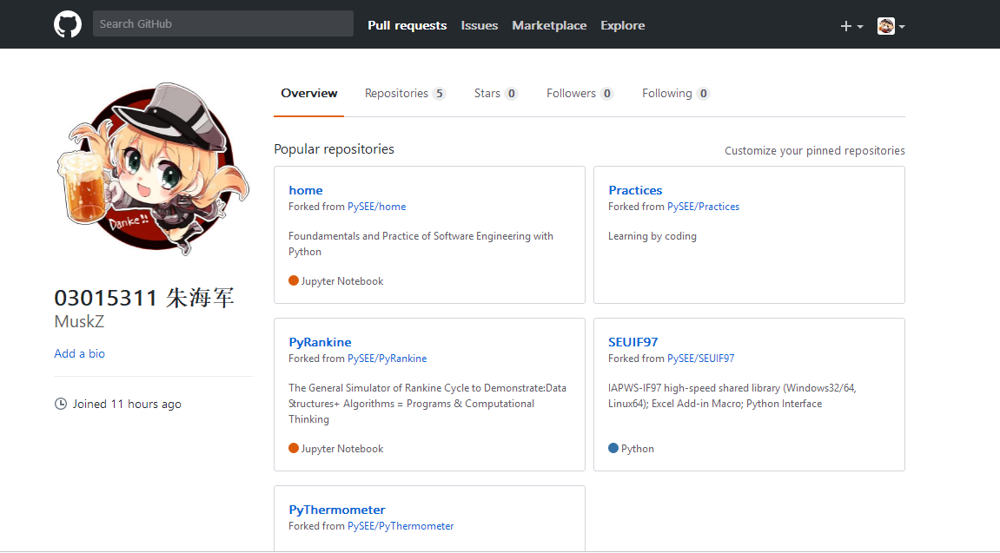
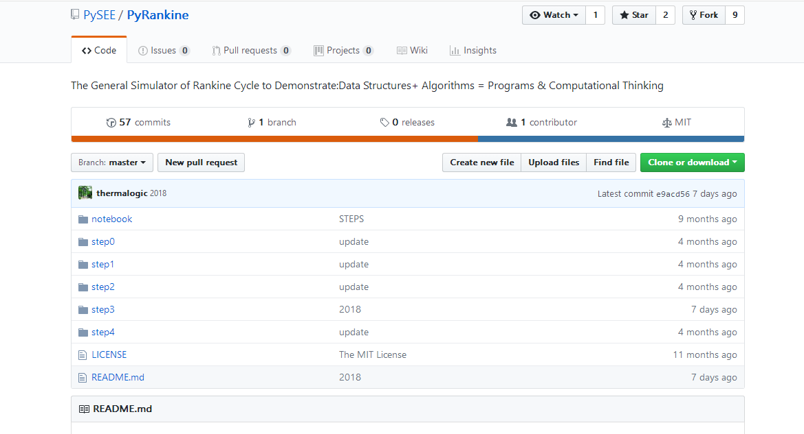

# **软件工程作业一**
>03015311 朱海军

## 一. 个人Github账户
* 账户名：MuskZ  
* 使用的电子信箱：15651768580@163.com  
* 账户主页面截图(fork课程仓库后)：  

  
## 二. Github 简介
### 1、什么是Github？
>确切的说 GitHub 是一家公司，位于旧金山，由 Chris Wanstrath, PJ Hyett 与 Tom Preston-Werner 三位开发者在2008年4月创办。gitHub于2008年4月10日正式上线，除了git代码仓库托管及基本的 Web管理界面以外，还提供了订阅、讨论组、文本渲染、在线文件编辑器、协作图谱（报表）、代码片段分享（Gist）等功能。  
>  
(Github的logo)  

### 2、Github与Git的关系
>注意github不是git，Git是一款免费、开源的分布式版本控制系统，他是著名的 Linux 发明者 Linus Torvalds 开发的。而Github主要提供基于 git 的版本托管服务。也就是说现在 GitHub 上托管的所有项目代码都是基于 Git 来进行版本控制的，所以 Git 只是 GitHub 上用来管理项目的一个工具而已。  
### 3、Github的基本功能
* *Repository*：分为公共仓库和私人仓库，仓库包含了所有的：版本、分支、标记信息。  
* *Explore*：发现、查看、研究Github上公共仓库中托管的代码项目。  
* *Gist*：有版本控制的代码粘贴服务，由此可以方便地共享文本或代码。  
* *Blog*：个人博客，只要向Github提交Commit就能发布新文章。  
* *Watch*：将感兴趣的仓库加入关注列表，如果所关注的仓库有更新会动态的进行邮件通知。  
* *Star*：一种更新的方式管理你所感兴趣的仓库的记录，任何之前预览过的仓库都能在其页面中找到。  
* *Fork*：最重要的功能之一，克隆别人仓库的代码到自己的项目中。可以作为子模块的形式使用，或二次开发。
### 4、Github对我们的用处
1. **学习优秀的开源项目**  
Github中的开源项目是我们最好的学习资料，可以学习他们优秀的设计思路、实现方式，而且还可以Fork过来利用，节省我们的时间。
2. **实现多人协作**  
利用Github发起一个项目，多人可以参与当中来，然后可以互相审核、合并，大大提高效率。
3. **写作**  
如果你喜欢写作，而且基于 Markdown， 并准备出版书籍，那么可以使用Github。
4. **找工作优势**  
如果你有一个活跃的 GitHub 账号，上面有自己不错的开源项目，还经常给别的开源项目提问题，push 代码，那么你找工作将是一个非常大的优势，现在程序员的招聘很多公司都很看中你 GitHub 账号。  
5. **搭建博客个人网站或者公司官网**  
现在越来越多的博客都是基于 GitHub Pages 来搭建的了，你可以随心所欲的定制自己的样式，再也不用忍受各大博客网站的约束与各式各样的广告了。
## 三. 课程Home、PyRankine和SEUIF97仓库简介  
>Home、PyRankine和SEUIF97都是上面所说的“Repository”，我现在已经将它们从PySEE拥有者那里fork到了自己的仓库中，相当于我在原项目的主分支上又建立了一个分支，我可以在该分支上任意修改，如果想将我的修改合并到原项目中时，可以pull request，这样原项目的作者就可以将我修改的东西合并到原项目的主分支上去，这样我就为开源项目贡献了代码，开源项目就会在大家共同的努力下不断壮大和完善。  
>具体的关系可用下图表示：  
>  

### 1. Home仓库：    

  
(Home仓库的主页面截图)  

Home仓库算是我们学习的课件吧，仓库中的guide文件夹内中的内容是说明我们学习前的准备工作，包括软件环境的建立(即对必要软件安装方法的介绍)、markdown介绍和给出一些对我们有帮助的参考教程和网站。notebook文件夹中的是对Python语言学习的课件和一些可供参考和学习的代码。README.md文件是对我们这门课程的介绍，默认是打开的，包括我们这门课程的学习目标、所需材料和书本、课程内容、课程评分和课程内容更新方法。schedule.md文件是对我们这门课程安排的介绍。

### 2. PyRankine仓库：  

  
(PyRankine仓库的主页面截图)  
 
郎肯循环是我们专业一个重要的内容，也是我们专业学习和研究的基础，PyRankine仓库主要介绍如何利用Python语言模拟和计算郎肯循环，数据结构+算法=程序或者计算思维。仓库中文件主要介绍了计算思维和编程技巧，通过一步一步拆分讲解的方式，并且给出了郎肯循环的编程示例和许多参考网站和教程。  

### 3. SEUIF97仓库：  

  
(SEUIF97仓库的主页面截图)  

由于计算时间的限制，直接使用IAPWS-IF97可能不适用。为此，东南大学开发者提供一个高速共享库，以便开发人员在过程模拟（如计算流体力学、热力循环计算、非平稳过程模拟和实时过程优化）中计算水和水蒸气的性质。这个库是用ANSI C编写的，能够达到三倍以上的计算速度。仓库中的文件主要介绍了在windows和Linux环境下的使用方法，给出了很多DEMO程序，可供交互学习，是一个开源的仓库。
