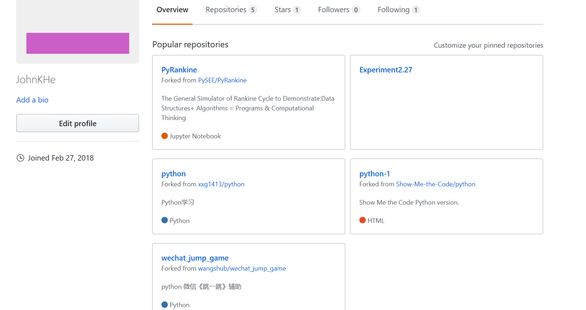

# Practice1

03015325 高贺同

## 一. Github账户

1. 户名：JohnKHe
2. 用的电子信箱：1016736163@qq.com
3. 账户主页面截图:

## 二. Github 简介

### 1.Github

> gitHub是一个面向开源及私有软件项目的托管平台，因为只支持git 作为唯一的版本库格式进行托管，故名gitHub。

### 2.Github的基本功能

* *Repository*：分为公共仓库和私人仓库，仓库包含了所有的：版本、分支、标记信息。
* *Explore*：发现、查看、研究Github上公共仓库中托管的代码项目。
* *Gist*：有版本控制的代码粘贴服务，由此可以方便地共享文本或代码。
* *Blog*：个人博客，只要向Github提交Commit就能发布新文章。
* *Watch*：将感兴趣的仓库加入关注列表，如果所关注的仓库有更新会动态的进行邮件通知。
* *Star*：一种更新的方式管理你所感兴趣的仓库的记录，任何之前预览过的仓库都能在其页面中找到。
* *Fork*：最重要的功能之一，克隆别人仓库的代码到自己的项目中。可以作为子模块的形式使用，或二次开发。

### 3.Github对我们的用处

* **提供大量的学习范例**

   Github中的开源项目是我们最好的学习资料，可以学习他们优秀的设计思路、实现方式，而且还可以Fork过来利用，节省我们的时间。

* **实现多人协作**

   利用Github发起一个项目，多人可以参与当中来，然后可以互相审核、合并，大大提高效率。

* **写作**

   如果你喜欢写作，而且基于 Markdown， 并准备出版书籍，那么可以使用Github。

## 三. 课程Home、PyRankine和SEUIF97仓库简介

Home、PyRankine和SEUIF97都是上面所说的“Repository”，我现在已经将它们从PySEE拥有者那里fork到了自己的仓库中，相当于我在原项目的主分支上又建立了一个分支，我可以在该分支上任意修改，如果想将我的修改合并到原项目中时，可以pull request，这样原项目的作者就可以将我修改的东西合并到原项目的主分支上去，这样我就为开源项目贡献了代码，开源项目就会在大家共同的努力下不断壮大和完善。

### 1.**Home**

Home仓库给我的感觉就像他的名字——家，我们需要帮助，遇到困难时都可以到home里去寻求解决办法。仓库中的guide文件夹内中的内容是说明我们学习前的准备工作，包括软件环境的建立(即对必要软件安装方法的介绍)、markdown介绍和给出一些对我们有帮助的参考教程和网站。notebook文件夹中的是对Python语言学习的课件和一些可供参考和学习的代码。README.md文件是对我们这门课程的介绍，默认是打开的，包括我们这门课程的学习目标、所需材料和书本、课程内容、课程评分和课程内容更新方法。schedule.md文件是对我们这门课程安排的介绍。

### 2.**PyRankine**

郎肯循环是我们专业相关的一个重要内容，PyRankine仓库主要介绍了如何利用Python语言模拟和计算郎肯循环。仓库中文件主要介绍了计算思维和编程技巧，通过一步一步拆分讲解的方式，并且给出了郎肯循环的一个编程示例和许多参考网站和教程。

### 3.**SEUIF97**

SEUIF97仓库是我校开发者开发的水和水蒸气性质的计算模型共享库，基于IAPWS-IF97，使用Python语言编写，以便我们以后在工程实际中用来模拟水和水蒸气的热力性质，提高水和水蒸气性质的计算速度。仓库中的文件主要介绍了在不同开发环境下的使用方法，给出了很多DEMO程序，可供交互学习。