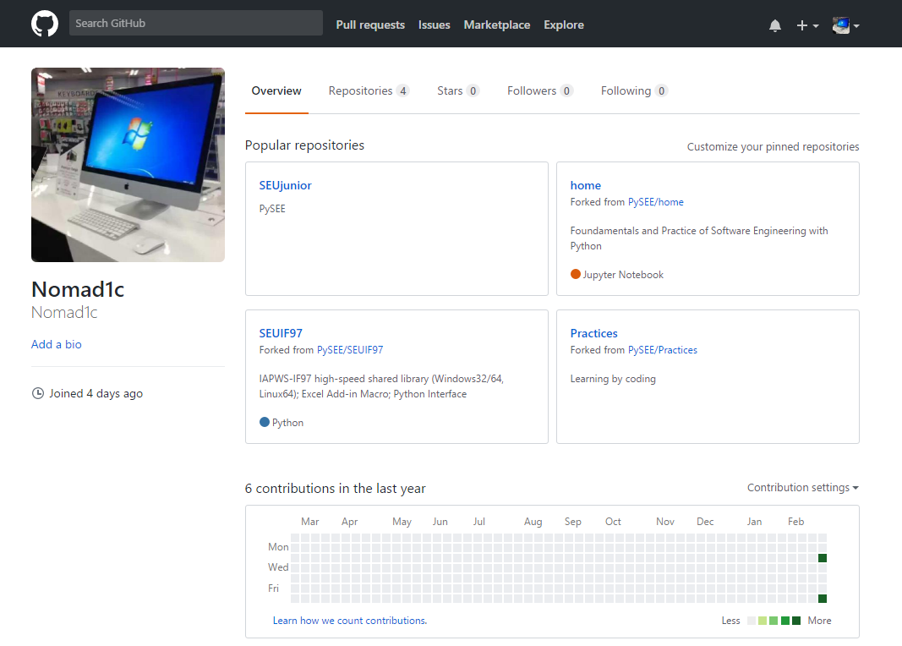

# Practice 1
03015435 陈悦欣
# 一. 个人Github账户
1. **账户名**：Nomad1c
2. **使用的电子信箱**：etro0103@outlook.com
3. **Github账户主页面截图**：

# 二. Github简介

## 1. Github
> Git是一个分布式的版本控制系统，最初由Linus Torvalds编写，用作Linux内核代码的管理。在推出后，Git在其它项目中也取得了很大成功，尤其是在Ruby社区中。目前，包括Rubinius和Merb在内的很多知名项目都使用了Git。Git同样可以被诸如Capistrano和Vlad the Deployer这样的部署工具所使用。

## 2. Github的基本功能
- **仓库（*Repository*）**：仓库意思即你的项目，想在GitHub上开源一个项目，就必须新建一个Repository。
- **收藏（*Star*）**：收藏项目，方便查看。
- **复制克隆项目（*Fork*）**：Fork项目是独立存在的，在原有项目上的一个分支，改动不会对原项目有影响。
- **发起请求（*Pull Request*）**：基于Fork上的。在Fork上做了改进，可以发起PR，原项目人觉得不错，可以接受PR，这时原有项目也有了改进。
- **关注（*Watch*）**：Watch了某个项目，项目更新时，会接收到通知。
- **事物卡片（*Issue*）**：比如，发现bug，但还没成型代码，需要讨论时用。解决后，可以close。

## 3. Github对我们的用处
- **提供大量的学习范例**  
Github中的开源项目是我们最好的学习资料，可以学习他们优秀的设计思路、实现方式，而且还可以Fork过来利用，节省我们的时间。
- **实现多人协作**  
利用Github发起一个项目，多人可以参与当中来，然后可以互相审核、合并，大大提高效率。
- **写作**  
如果你喜欢写作，而且基于 Markdown，并准备出版书籍，那么可以使用Github。

# 三. 课程Home、PyRankine和SEUIF97仓库简介
## Home仓库
&emsp;&emsp;Home仓库内的文件主要是指导学生对Python软件的学习和实践。图中README.md是对该仓库的介绍，进入Home仓库后默认打开；notebook和code文件夹中包含的是Python软件的参考和可供学习的代码；guide文件夹中是对软件学习的指导以及一些其他的参考教程和内容；practice是学习python软件所需进行的实践训练内容。
## PyRankine仓库
&emsp;&emsp;郎肯循环是我们专业相关的一个重要内容，PyRankine仓库主要介绍了如何利用Python语言模拟和计算郎肯循环。仓库中文件主要介绍了计算思维和编程技巧，通过一步一步拆分讲解的方式，并且给出了郎肯循环的一个编程示例和许多参考网站和教程。
## SEUIF97仓库
&emsp;&emsp;SEUIF97仓库是基于IAPWS-IF97，由东南大学开发者开发的水和水蒸气性质的计算模型共享库，这个仓库是用ANSI C编写的，拥有更快、更小的二进制文件和更好的兼容性，以便从不同的C++编译器访问DLL/SO。该仓库为开发人员提供了一个高速共享库，可在广泛的过程模拟中计算水和水蒸气的性质，如计算流体动力学(CFD)、热循环计算、非稳态过程的模拟和实时过程优化，而这些过程如果使用直接的IAPWS-IF97来实现则会消耗较多的时间。通过高速库，我们能以超过三倍的计算速度得到IAPWS-IF97的精确结果。仓库中的文件主要介绍了在windows和Linux环境下的使用方法，给出了很多DEMO程序，可供交互学习，是一个开源的仓库。