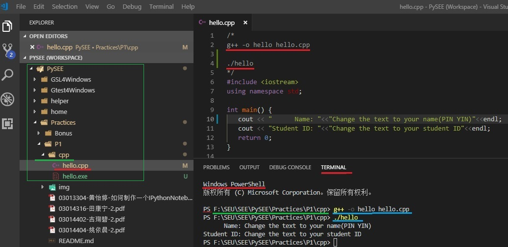

## Practice 1(15)

**Basic Programming**: Python,Jupyter,Visual Studio Code，MinGW-W64,Github

Deadline: 2019.03.17

## 练习内容

了解课程教学内容；参考 [The Guide of Building Software Environment](https://github.com/PySEE/home/tree/S2019/guide/BuildingSoftwareEnvironment.md), 建立软件开发环境; 编写简单代码，练习软件操作，完成相应的Word文档。

**1** 了解Github给出简介

**2** 建立Github账户，Fork不少于2个和课程学习内容有关的Github仓库到个人Github账户，提交截图

**3** 安装Python解释器和软件包autopep8, pylint；用IDLE编一个简单程序：print输出本人的学号和姓名，提交编辑源码和程序运行结果的截图

    * 科学计算等软件包可本次练习后，根据学习进度逐步安装  

**4** 安装Jupyter, 编写一个Jupyter Notebook交互计算文件。提交交互计算文件和运行截图。
   
* 交互计算文件(ipynb)：
  
   从 [02_INTRODUCTION_TO_PYTHON](http://nbviewer.jupyter.org/github/PySEE/home/blob/S2019/notebook/Unit1-2-02_INTRODUCTION_TO_PYTHON.ipynb)中任选一小段文本和代码，然后： 
   
     * 1）文本部分加上自己的学号和姓名（Markdown格式）
     * 2）代码部分加上用print输出自己的学号和姓名（Python3）

**5** 安装MinGW-W64，Visual Studio Code和Python，C/C++插件, 编写程序，提交源码和程序编写和运行截图。
   
* Python程序：从[02_INTRODUCTION_TO_PYTHON](http://nbviewer.jupyter.org/github/PySEE/home/blob/S2019/notebook/Unit1-2-02_INTRODUCTION_TO_PYTHON.ipynb)中任选一段代码，代码加上用print输出自己的学号和姓名。

* C++程序: 使用VS Code修改 [hello.cpp](./cpp/hello.cpp) 代码， 将其中的"Change the text to your name"和"Change the text to your student ID"，修改为自己的姓名( **用拼音，不要用中文** ）和学号，使用MinGW-W64编译运行. 提交: 修改后的源码，使用Visual Studio Code编辑代码和运行时的截图

```cpp 
/*
g++ -o hello hello.cpp

./hello
*/
#include <iostream>
using namespace std;
 
int main() {
   cout << "      Name: "<<"Change the text to your name(PIN YIN)"<<endl;
   cout << "Student ID: "<<"Change the text to your student ID"<<endl;
   return 0;
}
```




**6** 编写软件环境建立、程序设计过程和工作小结文档。文档使用微软Word2007以上版本docx格式。

## Word文档内容

  * 1 Github简介(1)
   
  * 2 本人Github账户名，使用的电邮；账户主页面截图(fork仓库后)(1)
  
  * 3 Python解释器及软件包的安装过程简要说明；使用IDLE编程和运行结果的截图(3)
  
  * 4 Jupyter Notebook安装过程的简要说明；Jupyter Notebook文件的运行截图 (2)

  * 5 安装MinGW-w64,Visual Studio code和Python，C/C++插件过程的简要说明；使用VS Code编写运行简单的Python,C++程序的截图 (4)
  
  * 6 建立开发环境等过程中出现的问题和解决方法,工作小结（2）

  * 7 微软Word文档排版(2)：参考《东南大学学生手册》中有关毕业设计报告格式规范
      
      * 版面整洁，合理划分和组织文档段落
      
      * 封面和目录
      
      * 页眉：练习一  学号 姓名
      
      * 页脚：页码

## 参考的目录和文件组织方式

```bash
 ├──<Practices>
 │   │ 
 │   |── <P1>
 │   │    │ 
 │   │    |── 学号-姓名-1.docx
 │   │    │ 
 │   │    |── <python>: 存放python源码文件夹, 文件名不要使用中文
 │   │    |           |
 │   │    |           │ ── *.py
 │   │    |
 │   │    |── <cpp>:  存放C/C++源码文件夹, 文件名不要使用中文
 │   │    |           |
 │   │    |           │ ── *.c/cpp
 │   │    │ 
 │   │    │── <notebook> 存放Jupyter Notebook等文件夹, 文件名不要使用中文
 │   │                  │
 │   │                  │── start.bat: 内容为jupyter notebook的bat文件 
 │   │                  │     
 │   │                  |── *.ipynb
 │   │
 |   │ ── <P2>
 │   │ 
```

## 电邮提交：

将练习目录压缩为：**学号-姓名-1.zip** (Word文件，Python源码，Jupyter Notebook文件，C++源码等)

* 1 电邮：cmh@seu.edu.cn

  * 主题：学号-姓名-1
  
  * 附件：学号-姓名-1.zip

* 2 **截至时间：** 2019.03.17

  * 截至时间后可补交，补交得分<=10. (2019.06.16)

* 3 改进更新：提交作业后可改进，改进截至时间：2019.06.16

## 参考：

* [The Guide of Building Software Environment](https://github.com/PySEE/home/tree/S2019/guide/BuildingSoftwareEnvironment.md) 

* Github
 
  * 知乎：怎样使用GitHub. http://www.zhihu.com/question/20070065

  * [The Simple Guide of Github](https://github.com/PySEE/home/blob/S2019/guide/TheSimpleGuide2Github.md)

  * Thank you for 100 million repositories https://blog.github.com/2018-11-08-100M-repos/
    
* Git
   
   * Git：https://git-scm.com/

   * [How to get started with GIT and work with GIT Remote Repo](http://www3.ntu.edu.sg/home/ehchua/programming/howto/Git_HowTo.html)

   * Scott Chacon，Ben Straub. [Pro Git](https://git-scm.com/book/en/v2/Getting-Started-About-Version-Control)

   * [DevTools-Git](http://nbviewer.jupyter.org/github/PySEE/home/blob/S2019/notebook/Unit7-5-DevTools-Git.ipynb)

* Python https://www.python.org/

   * Python development team. [Python Tutorial](https://docs.python.org/tutorial/index.html)

* Jupyter  http://jupyter.org/
    
    * Jupyter Documentation. http://jupyter.readthedocs.org/en/latest/
    
    * IPython https://ipython.org/
    
    * A gallery of interesting notebook： https://github.com/jupyter/jupyter/wiki/A-gallery-of-interesting-Jupyter-Notebooks

* Visual Studio Code  https://code.visualstudio.com/
  
   * Documentation: https://code.visualstudio.com/docs

   * Getting Started with **Python** https://code.visualstudio.com/docs/python/python-tutorial

   * **C/C++** for VS Code： https://code.visualstudio.com/docs/languages/cpp

   * **Git** Version Control in VS Code：https://code.visualstudio.com/docs/editor/versioncontrol

* GCC, the GNU Compiler Collection：http://gcc.gnu.org/

   * MinGW-W64:GCC for Windows 64 & 32 bits：http://mingw-w64.org/

   * GCC and Make：Compiling, Linking and Building C/C++ Applications http://www3.ntu.edu.sg/home/ehchua/programming/cpp/gcc_make.html

