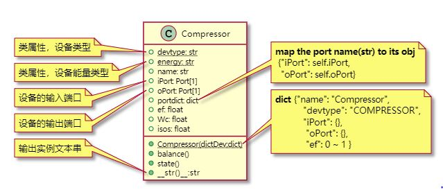
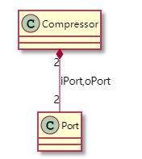

# PlantUML Class Diagrams

* [PlantUML: The Class Diagram ](https://plantuml.com/zh/class-diagram)

## The Class Diagram

### 1 class Compressor

```puml
class Compressor {
 + {static} devtype: str
 + {static} energy: str
 + name: str
 + iPort: Port[1]
 + oPort: Port[1]
 + portdict: dict
 + ef: float
 + Wc: float
 + isos: float
 + {static} Compressor(dictDev:dict)
 + balance()
 + state()
 + __str()__:str
}
note left of Compressor::devtype
  类属性，设备类型
end note
note left of Compressor::energy
  类属性，设备能量类型
end note
note left of Compressor::iPort
  设备的输入端口
end note
note left of Compressor::oPort
  设备的输出端口
end note
note left of Compressor::__str()__
  输出实例文本串
end note
note right of Compressor::portdict
  **map the port name(str) to its obj**
   {"iPort": self.iPort,
    "oPort": self.oPort}
end note
note right of Compressor::Compressor(dictDev:dict)
  **dict** {"name": "Compressor",
            "devtype": "COMPRESSOR",
            "iPort": {},
             "oPort": {},
             "ef": 0 ~ 1 }
end note

```



### The Composition relation of Compressor and Port's instance 

```puml
Compressor "2" *-- "2" Port : iPort,oPort
```



