# Flowchart using PlantUML

**Reference:** [PlantUML: Activity Diagram(beta)](https://plantuml.com/zh/activity-diagram-beta)

<!-- TOC -->

- [Flowchart using PlantUML](#flowchart-using-plantuml)
  - [The flowchart of the performance analysis of VCC cycle](#the-flowchart-of-the-performance-analysis-of-vcc-cycle)
  - [Simple action](#simple-action)
  - [start/stop/end](#startstopend)
  - [Conditional](#conditional)
  - [Several tests](#several-tests)
    - [horizontal mode](#horizontal-mode)
    - [vertical mode](#vertical-mode)
  - [Switch, case endswitch](#switch-case-endswitch)
  - [Conditional with stop on an action - kill, detach](#conditional-with-stop-on-an-action---kill-detach)
  - [Repeat loop](#repeat-loop)
    - [1 basic Repeat loop](#1-basic-repeat-loop)
    - [2 using the `backward` keyword](#2-using-the-backward-keyword)
    - [3 Break on a repeat loop `break`](#3-break-on-a-repeat-loop-break)
  - [while loop](#while-loop)
    - [1  basic while loop](#1--basic-while-loop)
    - [2 while loop with lables](#2-while-loop-with-lables)
    - [3  an `infinite` while loop](#3--an-infinite-while-loop)
  - [Notes](#notes)
  - [Colors](#colors)
  - [Lines without arrows](#lines-without-arrows)
  - [Arrows](#arrows)
  - [Group, Partition, Package, Rectangle or Card](#group-partition-package-rectangle-or-card)
  - [SDL(Specification and Description Language)](#sdlspecification-and-description-language)
  - [Complete example](#complete-example)

<!-- /TOC -->

## The flowchart of the performance analysis of VCC cycle

```puml
: Instancing the cycle using the dict of cycle 
      **the instance of devices**    
      **the instance of connector**;
note right
    get the port state: pt/px/tx 
      when **create** the port of device 
end note
:The port state of devices;
note right
    comps[].state() by **the thermal process**
    node[].state()  by **the combined data**
end note
:The mass and energy balance of devices on the mdot;
note right
    Qin,Qout, Win,Wout, etc
end note

:The performance of cycle  on the mdot;
: Print results on console  
  Save  results to text file; 
```

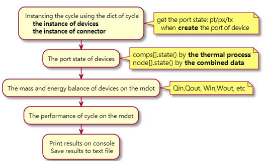

## Simple action

Activities label starts with `:` and ends with `;`

They are implicitly linked in their definition order.
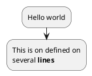

## start/stop/end

You can use **start and stop** keywords to denote the beginning and the end of a diagram.

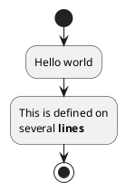
You can also use the **end** keyword.

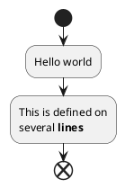

## Conditional

You can use **if, then and else** keywords to put tests if your diagram. 

Labels can be provided using parentheses **()**.

The 3 syntaxes are possible:

* `if (...) then (...)`

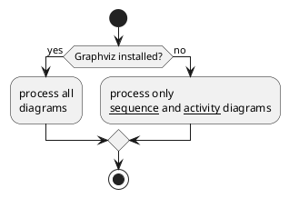

* `if (...) is (...) then`

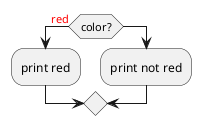

* `if (...) equals (...) then`


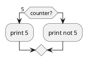

## Several tests 

### horizontal mode

You can use the **elseif** keyword to have several tests (by default, it is the horizontal mode):

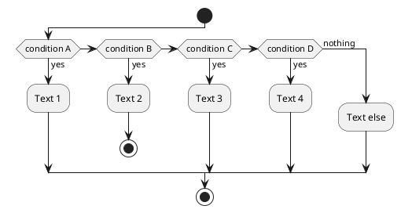

### vertical mode

You can use the command `!pragma useVerticalIf on` to have the tests in vertical mode:

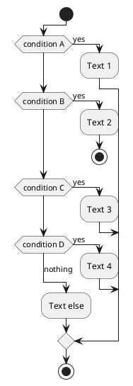

## Switch, case endswitch

You can use **switch, case and endswitch** keywords to put switch in your diagram.
Labels can be provided using parentheses().
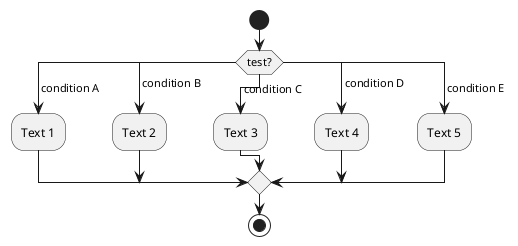

## Conditional with stop on an action - kill, detach

You can **stop** action on a if loop.

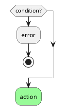

But if you want to stop at the precise action, you can use the **kill** or **detach** keyword:

* kill
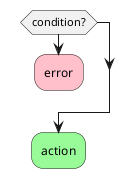


* detach


## Repeat loop

### 1 basic Repeat loop

You can use **repeat and repeat while** keywords to have repeat loops.
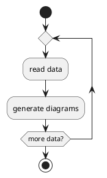
### 2 using the `backward` keyword

It is also possible to use a full action as repeat target and **insert** an action in the return path using the **backward** keyword.

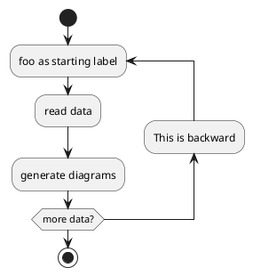

### 3 Break on a repeat loop `break`

You can use the **break** keyword after an action on a loop.

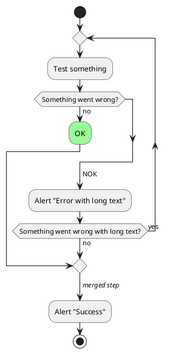

##  while loop

### 1  basic while loop

You can use **while** and **end while keywords to have repeat loops.

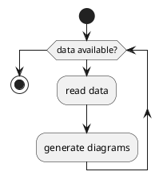

### 2 while loop with lables

It is possible to provide **a label** after the **end while** keyword, or using the **is** keyword.

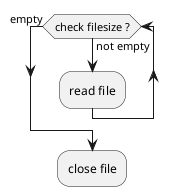

### 3  an `infinite` while loop
 
 you are using **detach** to form an `infinite` **while** loop, then you will want to also hide the partial arrow that results using `-[hidden]->`

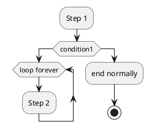

## Notes

1. Text `formatting` can be done using creole wiki syntax.

2. A note can be floating, using **floating** keyword.

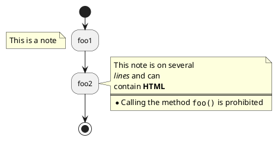

* You can add note on **backward** activity
```puml
@startuml
start
repeat :Enter data;
    :Submit;
    backward :Warning;
        note right: Note
repeat while (Valid?) is (No) not (Yes)
stop
@enduml
```

## Colors

You can use specify a color for some activities.

```puml
@startuml

start
:starting progress;

#HotPink:reading configuration files
These files should edited at this point!;

#AAAAAA:ending of the process;

@enduml
```

## Lines without arrows

You can use `skinparam ArrowHeadColor none` in order to connect activities using lines only, `without arrows`.

```puml
@startuml
skinparam ArrowHeadColor none
start
:Hello world;
:This is on defined on
several **lines**;
stop
@enduml
```

```puml
@startuml
skinparam ArrowHeadColor none
start
repeat :Enter data;
:Submit;
backward :Warning;
repeat while (Valid?) is (No) not (Yes)
stop
@enduml
```

## Arrows

Using the **->** notation, you can add texts to arrow, and change their color.
It's also possible to have dotted, dashed, bold or hidden arrows.

```puml
@startuml
:foo1;
-> You can put text on arrows;
if (test) then
    -[#blue]->
    :foo2;
    -[#green,dashed]-> The text can
    also be on several lines
    and **very** long...;
    :foo3;
else
    -[#black,dotted]->
    :foo4;
endif
-[#gray,bold]->
:foo5;
@enduml
```

## Group, Partition, Package, Rectangle or Card

You can group activity together by defining:
* group;
* partition;
* package;
* rectangle;
* card.

```puml
@startuml
start
group Group
  :Activity;
end group
floating note: Note on Group

partition Partition {
  :Activity;
}
floating note: Note on Partition

package Package {
  :Activity;
}
floating note: Note on Package 

rectangle Rectangle {
  :Activity;
}
floating note: Note on Rectangle 

card Card {
  :Activity;
}
floating note: Note on Card
end
@enduml

```

## SDL(Specification and Description Language)

By changing the final `;` separator, you can set different rendering for the activity:
```
|
<

/
]
}
```

```puml
@startuml
:Ready;
:next(o)|
:Receiving;
split
:nak(i)<
:ack(o)>
split again
:ack(i)<
:next(o)
on several line|
:i := i + 1]
:ack(o)>
split again
:err(i)<
:nak(o)>
split again
:foo/
split again
:i > 5}
stop
end split
:finish;
@enduml
```


## Complete example

```puml
@startuml
start
:ClickServlet.handleRequest();
:new page;
if (Page.onSecurityCheck) then (true)
  :Page.onInit();
  if (isForward?) then (no)
    :Process controls;
    if (continue processing?) then (no)
      stop
    endif

    if (isPost?) then (yes)
      :Page.onPost();
    else (no)
      :Page.onGet();
    endif
    :Page.onRender();
  endif
else (false)
endif

if (do redirect?) then (yes)
  :redirect process;
else
  if (do forward?) then (yes)
    :Forward request;
  else (no)
    :Render page template;
  endif
endif

stop
@enduml

```