# Flowchart using PlantUMNL

* [Activity Diagram(beta)](https://plantuml.com/zh/activity-diagram-beta)

## 1. Simple action

Activities label starts with `:` and ends with `;`

They are implicitly linked in their definition order.

```puml
: Instance of Cycle using the dict of cycle 
      * the Instance of devices    
      * the instance of connector             
  The port state with tx/px/pt;
:The port state of device;
:The mass and energy balance of device on the mdot ;
:The performance of cycle  on the mdot;
: Print results on console  
  Save  results to text file; 
```

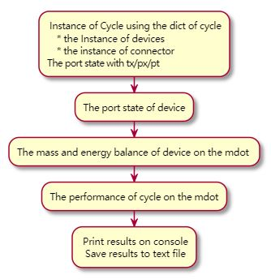


## 2 start/stop/end

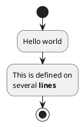

## 2.Conditional

You can use **if, then and else** keywords to put tests if your diagram. 

Labels can be provided using parentheses**()**.

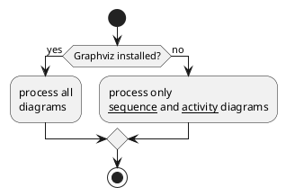

## 3.if then elseif example

You can use the **elseif** keyword to have **several** tests :
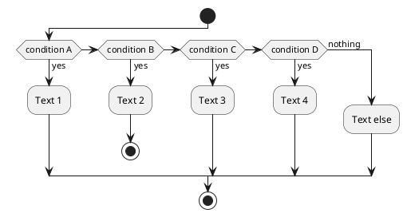

### 4. Repeat loop
You can use **repeat and repeat while** keywords to have repeat loops.
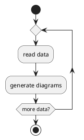

### 5. **while** loop

You can use **while and end while** keywords to have repeat loops.
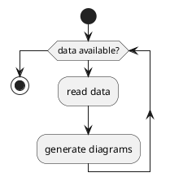

### 6.while loop with lables

It is possible to provide **a label** after the **end while** keyword, or using the is keyword.
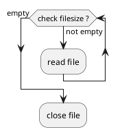

### 7 activity diagram with parallel processing

You can use **fork**, fork again and end fork keywords to denote **parallel** processing.

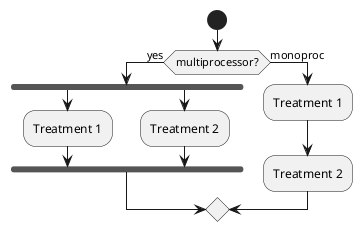
### 8.add notes on activity diagram


#### 8.1 Text formatting

1. Text `formatting` can be done using creole wiki syntax.

2. A note can be floating, using **floating** keyword.

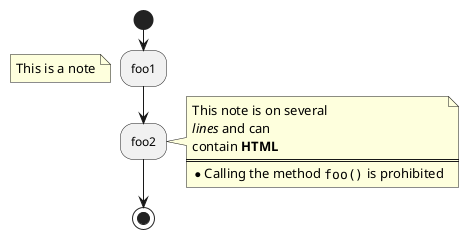

#### 8.2 Colors
You can use specify a color for some activities.

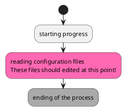

### 9 Arrows

#### 9.1 colored arrows
Using the **->** notation, you can add texts to arrow, and change their color.It’s also possible to have dotted, dashed, bold or hidden arrows.

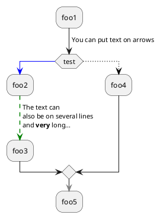

### 10 Grouping

You can group activity together by defining **partition**:
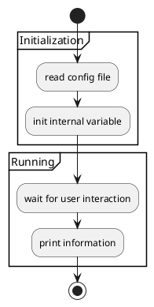

### 11 pipe `|`
Using pipe `|`, you can define `swimlanes`.

It’s also possible to change swimlanes color.

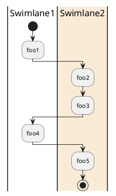

### 12 remove an arrow

It’s possible to **remove an arrow** using the **detach** keyword.
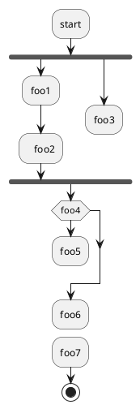

### 14. set different rendering for the activity

By changing the final ; separator, you can set different rendering for the activity:
```
|
<

/
]
}
```
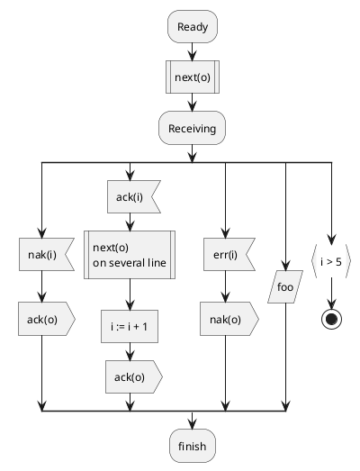

### 16 一个复杂流程图的例子
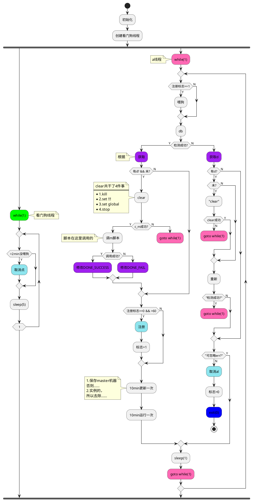