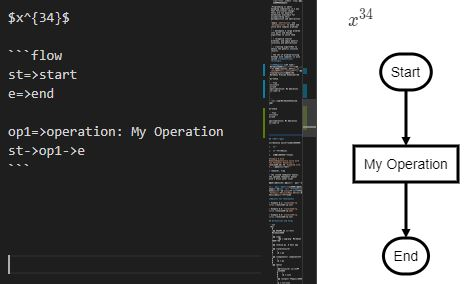

## Practice 2(20)

**Object-oriented Programming**：The General Rankine Cycle Simulator 

Apply `computational thinking` to model and solve more complex problems

**Deadline:**  2020.05.19

## Contents and Requirements

Reference [PyRankine](https://github.com/PySEE/PyRankine), design a general energy balance software with Python to analysis the following cycles:

* [Example 8.1：An Ideal Regenerative Cycle](./rankine81.md)

* [Example 8.5：A Regenerative Cycle with Open Feedwater Heater](./rankine85.md)
 
* [Example 8.6：A Reheat–Regenerative Cycle with Two Feedwater Heaters](./rankine86.md) 

**注意**：练习不使用Jupyter Notebook；使用Visual Studio Code进行代码设计和文档撰写等工作。

### 数据文件和Python3源码(12)

* 数据文件：建立描述循环系统和设备的json文件(2)

* Python3源码(9)
 
   * 使用类描述循环中的设备(组件)、节点(5)

   * 编程读取系统描述json文件，解析其描述的循环系统，进行循环的能量平衡分析(4)

* 数据文件：输出分析结果到数据文件(1)
  
### 软件设计工作Markdown文档(8)

>**提示** ：VS Code中Markdown文档公式和流程图，可`使用图片`。如果有兴趣和时间，使用`LaTex数学公式和脚本描述图像`(如dot语言脚本)，需要安装Markdown Preview Enhanced插件
>
>$x^{34}$
>>
>```dot
>digraph G {
>    A -> B;
>    A -> c;
>}
>```
> 
>
* 设计问题简要描述(1); 

* 程序设计方案简要描述(6)
  * 总体思路；软件项目总体结构； 计算分析主流程图  
  * 系统json文件描述；
  * 节点和设备类的设计；
  * 循环能量平衡计算过程；

* 设计工作小结(1)

    小结中，建议结合练习，给出你对下面短文的理解:
 
  >Programming is about managing complexity in a way that facilitates change. There are two powerful mechanisms available for accomplishing this: decomposition and abstraction`
  > 
  >Apply `abstraction` and `decomposition` to model and solve more complex problems
  >
  > * decompose a large problem into parts and design algorithms to solve them
  >
  > * recognise similar problems, and apply generic solutions and abstractions
  >
  > * creating algorithms to obtain the generic solution results
  >
  > The set of problem-solving methods with computer is also called **Computational Thinking**. 
  
## 提示

通用Rankine Cycle程序的泛化要点:

1.  设备

2.  设备间连接关系

3.  系统能量平衡计算方法

[Example 8.6：A Reheat–Regenerative Cycle with Two Feedwater Heaters](./rankine86.md) 比 `Example8.1，8.5`, 多了不同类型的设备

* reheater, trap

* the closed feedwater heater, the opended feedwater heater with 1 drain water inlet

需要在理解示例基础上，增加新设备。

**增加新设备的工作**：首先，需要定义新设备的**唯一类型标识字符串**，然后，是设备的`json描述`，计算分析`Python类实现及相关代码`工作，实现更通用的循环计算程序。

**Results for reference**

* Example 8.1: [rankine81-sp.txt](./rankine81-sp.txt)

* Example 8.5: [rankine85-sp.txt](./rankine85-sp.txt)

* Example 8.6: [rankine86-sp.txt](./rankine86-sp.txt)

## Directories and Files

```txt
 ├──<Practices>
     │ 
     |── <P2>
          │ 
          |── README.md 设计工作Markdown文档
          |
          |── 
          |     |── *.jpg/png  Markdown文档图片
          | 
          |── rankine.py  # main app
          |
          |── <rankinecycle> 
          │    |
          │    |─ *.py
          |
          |── <components> components包
          │    |
          │    |─ *.py
          │   
          |── <data>
                |        
                |──<txtcycle> 循环描述json文件
                │    |
                │    |─ *.json
                │ 
                |── <output> 分析结果文件
                      |
                      |─ *.txt/json
``` 
### 建议配置：项目目录外的pyc目录

Python程序运行import模块.py文件时，会生成相应的.pyc文件（编译的字节码byte-compiled），并保存于当前目录的新文件夹__pycache__当中，以加快下次执行文件的速度。

如果不希望 __pycache__位于项目工作目录中，可以

1. 建立一个项目工作目录外的`.pyc文件目录`
2. 在操作系统中增加系统环境变量`PYTHONPYCACHEPREFIX`(Python3.8以上解释器支持),值为建立的`.pyc文件目录`

这个目录将被计算机中所有的Python项目公用。

## 提交：

* 电邮： cmh@seu.edu.cn
  * 主题：学号-姓名-2
  * 附件：工作目录压缩文件： **学号-姓名-2.zip**；

* 截至时间：2020.05.19
  * 截至时间后可补交，补交得分<=13. (2020.06.14)

## 参考资源：

* [PySEE/PyRankine](https://github.com/PySEE/PyRankine)

* [Rankine Cycle：OOP](http://nbviewer.ipython.org/github/PySEE/home/tree/S2020/notebook/Unit4-3-RankineCycle-OOP.ipynb)

* [Rankine Cycle：General](http://nbviewer.ipython.org/github/PySEE/home/tree/S2020/notebook/Unit4-4-RankineCycle-General.ipynb)


