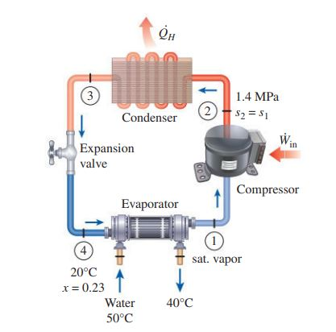
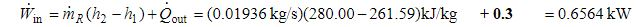
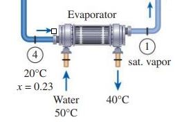

## Practice 2(12)

**Object-oriented Programming**：The  vapor-compression refrigeration cycle simulator 

**Deadline:**  2023.05.27

## 地源热泵分析

以[SimVCCE分支B2023-2](https://gitee.com/thermalogic/simvcce)中的Python语言版本为基础进行设计，使其可计算如下[地源热泵](./8th-11-43_geothermal.pdf)

A heat pump with R134a as the working fluid is used to keep a space at `25°C` by **absorbing heat from geothermal water** that enters the evaporator at `50°C` at a rate of `0.065 kg/s` and leaves at `40°C`. 

The refrigerant enters the evaporator at `20°C` with a quality of `23 percent` and leaves at the inlet pressure as saturated vapor. 

The refrigerant **loses `300 W` of heat to the surroundings** as it flows through the compressor and the refrigerant leaves the compressor at `1.4 MPa` at the same entropy as the inlet.



**Determine**

1. the degrees of subcooling of the refrigerant in the condenser (`3.8°C`)
2. the mass flow rate of the refrigerant (`0.0194 kg/s`)
3. the heating load and the COP of the heat pump (`3.07kW, 4.68`)
4. the theoretical minimum power input to the compressor for the same heating load (`0.238kW`)


**注意**

* 8th-11-43_geothermal.pdf文档中**Win**有误，应改为
   

## 编码(6分)

* 增加设备类(4)：the evaporator absorbing heat from geothermal water 

    

* Condenser类(1)：增加the degrees of subcooling of the refrigerant计算
* VCCycle类(1)：增加the theoretical minimum power input计算


#### 编码提示

```python
"""
EvaporatorHeatExchange

the combined evporator and the water duct

                         ↓   iPort refrigerant
                   ┌─────┼─────┐
                   │ → ┌─┼─┐←  │
        oPortW   ← ┤ Q │ Z │ Q │← iPortW
                   │ → └─┼─┘←  │
                   └─────┼─────┘
                         ↓      oPort refrigerant

json example
 {
            "name": "EvaporatorHeatExchanger",
            "devtype": "EVAPORATOR_HEAT_EXCHANGER",
            "iPort": {},
            "oPort": {
                "x": 1.0
            },
            "iPortW": {
                "p": 0.1,
                "t": 50.0,
                "mdot":0.065,
                "refrigerant": "WATER"
            },
            "oPortW": {
                "p": 0.1,
                "t": 40.0,
                "refrigerant": "WATER"
            }
        }
"""
from components.port import Port

class EvaporatorHeatExchanger:

    energy = "QIN"
    devtype = "EVAPORATOR_HEAT_EXCHANGER"

    def __init__(self, dictDev):
        """ Initializes the EVAPORATOR_HEATIN_EXCHANGER """
        self.name = dictDev['name']
        self.iPort = Port(dictDev['iPort'])
        self.oPort = Port(dictDev['oPort'])
        self.iPortW = Port(dictDev["iPortW"])
        self.oPortW = Port(dictDev["oPortW"])
```

## 循环json文件(1分)

* compressor有散热

## Markdown文档(5分)

### 设计方案(4)

以可计算Example11-1,Example11-5和练习中地源热泵的分析软件设计为对象，给出

* 面向对象程序设计的总体思路

* 设计方案的如下几个方面内容


    * 端口、设备、连接器、循环分析类设计(含UML类图）

    * 端口连接算法(含算法流程图)
 
       *  算法要点见`class Connector`的`self.__add_node`方法

    * 物性计算、循环计算算法(含算法流程图)
 
       * 算法要点见`class VCCycle`的` def __component_simulator(self)`方法
 
    * 循环json数据文件设计
    
       * 端口、设备、端口连接关系
  
### 设计小结(1)

  * 练习中遇到的问题、解决过程


#### 文档提示

* 数学公式使用：**LaTex** 

* UML、流程图使用: [PlantUML文本描述](https://gitee.com/thermalogic/simvcce/tree/B2023/uml)

### 工作目录

```txt
 
 <学号-姓名-2>
     │ 
     │── README.md: Markdown文档
     | 
     |──  Markdown文档使用的图形文件
     |
     |── vccapp_json.py
     |
     |── <components> 
     |
     |── <vcc> 
     |
     |── <jsonmodel> 循环json数据文件
     |
     |── <result> 计算结果数据文件 
```  
