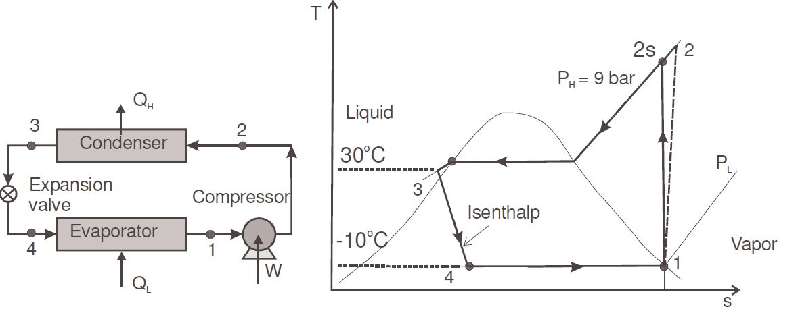
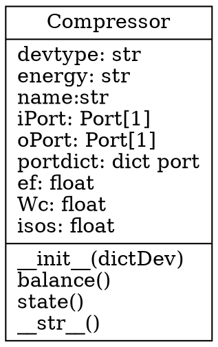

## Practice 2(10)

**Object-oriented Programming**：The  vapor-compression refrigeration cycle simulator 

Apply `computational thinking` to model and solve the industrial system problems

**Deadline:**  2022.05.27

## Contents and Requirements

以[SimVCCE](https://github.com/thermalogic/SimVCCE)中的Python语言版本为基础，编写代码，使其可计算如下循环：

* Thuan Ke Nguyen, [CHE 302 Chemical and Materials Engineering Thermodynamics I: chap7-2](ttps://www.cpp.edu/~tknguyen/che302/Notes/hchap7-2.pdf)

### The vapor-compression refrigeration cycles 

Refrigerant 134a is the working fluid in an ideal vapor-compression refrigeration cycle that communicates thermally with

* a cold region at -10°C 

* Saturated vapor enters the compressor at -10°C 

* liquid leaves the condenser at 0.9MPa and 30°C 

* The mass flow rate of the refrigerant is 0.08kg/s 

**Determine**

 * the compressor power, in kW
 
 * the refrigeration capacity, in tons
 
 * the coefficient of performance

### 1. Example 7.2-5 Page4 

* The compressor has **an efficiency of 80%** 

### 2 Modified Example 7.2-5 Page4 

* Superheated vapor **leaves the compressor at 50°C** 

**Determine**

* **the efficiency of compressor, in %** 

  

## 计分

### Python源码(4)

* 循环数据Python模块(2)

* 设备类(2)

### Markdown文档(6)

* 设计任务简要描述

* 设计方案简要描述
  * 端口、设备、端口连接关系和循环输入数据变量的数据结构
  * 端口、设备、连接器、循环分析类（含UML图）
  * 端口连接、连接节点物性和循环计算等算法(主要算法、循环分析流程图)
 
* 将下面的短文译为中文； 结合练习工作，给出你对短文的理解

>Programming is about managing complexity in a way that facilitates change. There are two powerful mechanisms available for accomplishing this: decomposition and abstraction`

>Apply abstraction and decomposition to solve more complex problems

> * decompose a large problem into parts and design algorithms to solve them

> * recognise similar problems, and apply generic solutions and abstractions

> * creating algorithms to obtain the generic solution results

The set of problem-solving methods with computer is also called **Computational Thinking**.
 
### 练习提示

**代码**

[SimVCCE](https://github.com/thermalogic/SimVCCE) 示例中压缩机类的压缩过程是等熵过程，练习中是不可逆非等熵过程。

练习需要编程处理：不同已知参数条件下的不可逆非等熵过程

1. compressor压缩机类模块：

   * 已知压缩机效率：计算`出口参数`
 
   * 已知出口参数(压缩机出口温度): 计算`压缩机效率`

2. 循环数据模块

   * `设备`和`端口连接器`字典

**文档** ：

* 数学公式可使用：`LaTex` (在VS Code中**需**[Markdown Preview Enhanced](https://shd101wyy.github.io/markdown-preview-enhanced/#/zh-cn/)插件支持显示)

>* LaTex数学公式: $z=\frac{x}{y}$

* UML、流程图等: Microsoft Visio 或者 flowchart.js、dot文本描述

## 建议工作目录

```txt
 
|── <P2>
     │ 
     │── README.md: Markdown文档
     | 
     |──  Markdown文档使用的图形文件
     |
     |── vccapp.py
     |
     |── <components> 
     |        
     |── <vccmodel> 
     |
     |── <vcc> 
     |
     |── <result> 计算结果数据文件 
```  

## 提交：

* 电邮： cmh@seu.edu.cn
  * 主题：学号-姓名-2
  * 附件：工作目录压缩文件： **学号-姓名-2.zip** 其中，必须有**计算结果文件**

## 图形的文本描述：flowchart.js、dot

* https://shd101wyy.github.io/markdown-preview-enhanced/#/zh-cn/diagrams

### flowchart.js描述流程图

* https://github.com/adrai/flowchart.js

```flow
st=>start
e=>end
op1=>operation: My Operation
st->op1->e
```

### dot描述UML类图

* http://www.graphviz.org/



