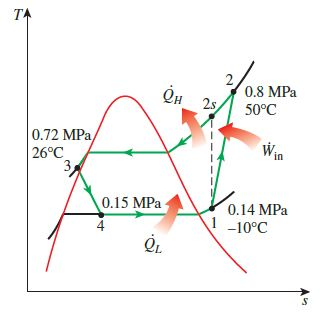

## Practice 2(10)

**Object-oriented Programming**：The  vapor-compression refrigeration cycle simulator 

**Deadline:**  2022.05.27

## 三种循环计算条件的程序编码(6分)

以[SimVCCE](https://gitee.com/thermalogic/simvcce)中的Python语言版本为基础进行设计，使其可计算如下实际循环为基础修改出的三种不同循环场景

Yunus A. Cengel, Michael A. Boles,Thermodynamics: An Engineering Approach, 8th Edition, McGraw-Hill,2015

* Page614-615 Example 11-2: The Actual Vapor-Compression Refrigeration Cycle 

Refrigerant-134a enters the compressor of a refrigerator as superheated vapor at 0.14 MPa and -10°C at a rate of 0.05kg/s and leaves at 0.8 MPa and 50°C.

The refrigerant is cooled in the condenser to 26°C and 0.72MPa and is throttled to 0.15 MPa.

Disregarding any heat transfer and pressure drops in the connecting lines between the components, 

**Determine**

* (a) the rate of heat removal from the refrigerated space and the power input to the compressor,
* (b) the isentropic efficiency of the compressor, and
* (c) the coefficient of performance of the refrigerator.



这个循环参数基础是

  * 已知制冷剂的质量流量, 压缩机出口压力0.8Ma，出口温度50°C : 计算`压缩机等熵效率`和`耗功`

修改出的另二种循环参数条件

  * 压缩机出口温度`未知`，已知出口压力0.8Ma，压缩机**等熵效率90%**, 计算压缩机`出口温度`和`耗功`

  * 制冷剂的质量流量`未知`，已知出口压力0.8Ma，压缩机等熵效率90%, **压缩机耗功1.8kW**, 计算`制冷剂的质量流量`，压缩机`出口温度`

修改**Compressor**类代码，建立三种场景循环**json数据文件**，计算三种场景下循环的参数和性能指标 

## Markdown文档(4分)

* 设计任务简要描述

* 设计方案
  * 端口、设备、端口连接关系和循环输入数据的数据结构设计
  * 端口、设备、连接器、循环分析类设计（含UML类图）
  * 端口连接、连接节点物性和循环计算等算法(含算法、循环分析流程图)
 
* 小结：
   * 练习中遇到的问题、解决过程和方法

#### 文档提示

* 数学公式可使用：`LaTex` (在VS Code中**需**[Markdown Preview Enhanced](https://shd101wyy.github.io/markdown-preview-enhanced/#/zh-cn/)插件支持显示)

>* LaTex数学公式: $z=\frac{x}{y}$

* UML、流程图等: Microsoft Visio 或者 [PlantUML文本描述](https://gitee.com/thermalogic/simvcce/tree/B2022/doc)
  
### 工作目录

```txt
 
|── <P2>
     │ 
     │── README.md: Markdown文档
     | 
     |──  Markdown文档使用的图形文件
     |
     |── vccapp_json.py
     |
     |── <components> 
     |
     |── <vcc> 
     |
     |── <jsonmodel> 循环数据json文件
     |
     |── <result> 计算结果数据文件 
```  

## 提交：

* 电邮： cmh@seu.edu.cn
  * 主题：学号-姓名-2
  * 附件：工作目录压缩文件： **学号-姓名-2.zip** 其中，必须有**计算结果文件**

 