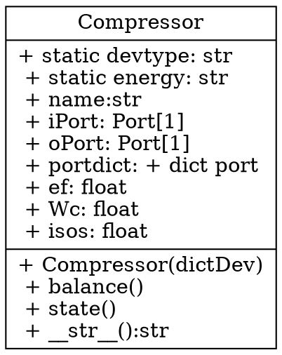

# 文本描述图形

* flowchart.js、dot、PlantUML

* https://shd101wyy.github.io/markdown-preview-enhanced/#/zh-cn/diagrams

## flowchart.js描述流程图

* https://github.com/adrai/flowchart.js

```flow
st=>start
e=>end
op1=>operation: My Operation
st->op1->e
```


## dot描述UML类图

* http://www.graphviz.org/




### PlantUML描述UML类图

* https://plantuml.com/zh/

* https://plantuml.com/en/class-diagram

```puml
class Compressor {
 + {static} devtype: str
 + {static} energy: str
 + name: str
 + iPort: Port[1]
 + oPort: Port[1]
 + portdict : dict port
 + ef: float
 + Wc: float
 + isos: float

 + {static} Compressor(dictDev)
 + balance()
 + state()
 + __str()__:str
}
note left of Compressor::devtype
  类属性，设备类型
end note
note left of Compressor::energy
  类属性，设备能量类型
end note
note left of Compressor::iPort
  设备的输入端口
end note
note left of Compressor::oPort
  设备的输出端口
end note
note right of Compressor::__str()__
  输出实例文本串
end note
```

