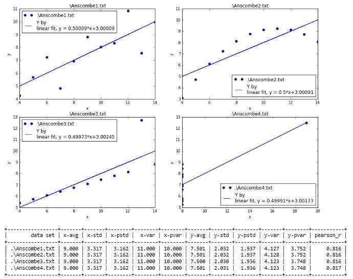

## Practice 4

**Data Analysis**(10)：Statistics, regression and visualization

* Deadline: 2019.06.02

## Problem

John V. Guttag. Introduction to Computation and Programming Using Python: With Application to Understanding Data(Second Edition). MIT Press, 2016. 

**21.5 Statistical Measures Don't, Tell the Whole Story**（Page411-412） 
  
In 1973, the statistician F.J. Anscombe published a paper containing the table below. It contains the <x, y> coordinates of the points in each of four data sets.

|x0 |y0|x1|y2|x2|y2|x3|y3|
| ---- |:------:| :------:| :------:|  :------:| :------:| :------:|  ----:|
|10.0|	8.04 |	10.0|	9.14 |	10.0 	|7.46	|8.0    |6.58|
|8.0| 	6.95 |	8.0 |	8.14 |	8.0     |6.77	|8.0    |5.76|
|13.0| 	7.58 |	13.0|	8.74 |	13.0    |12.74	|8.0    |7.71|
|9.0|	8.81 |	9.0 |	8.77 |	9.0     |7.11	|8.0    |8.84|
|11.0| 	8.33 |	11.0|	9.26|	11.0    |7.81	|8.0    |8.47|
|14.0| 	9.96 |	14.0|	8.10 |	14.0    |8.84	|8.0    |7.04|
|6.0|	7.24 |	6.0 |	6.13 |	6.0     |6.08	|8.0 	|5.25|
|4.0| 	4.26 |	4.0 |	3.10| 	4.0     |5.39	|19.0 	|12.5|
|12.0|	10.84| 	12.0| 	9.13| 	12.0    |8.15	|8.0 	|5.56|
|7.0| 	4.82 | 	7.0 |	7.26| 	7.0     |6.42	|8.0 	|7.91|
|5.0| 	5.68 | 	5.0 | 	4.74| 	5.0     |5.73	|8.0 	|6.89|

## 要求(10分)：

  使用Python文件或Jupyter Notebook实现 
  
Note: **不使用pandas包**

* 1 四组数据的数据文件(1分)：纯文本格式或MS Excel表格；

* 2 数据分析对象表达(3分)：**从数据文件读取数据,形成数据分析对象**

* 3 统计指标计算输出(3分)：计算均值、方差和相关系数等统计指标（2分，可使用Python统计库、Numpy或Scipy）；统计结果输出(1分) [参考输出](#参考输出)

* 4 回归分析和图形输出(3分): **线性回归**（1分）；图形输出（2分）[参考输出](#参考输出)

参考: [21 LIES DAMNED LIES ANDSTATISTICS](http://nbviewer.ipython.org/github/PySEE/home/tree/S2019/notebook/Lecture5-2-21_LIES_DAMNED_LIES_AND_STATISTICS.ipynb)

## 提交：

* 1 电邮：cmh@seu.edu.cn 
  * 主题：学号-姓名-4
  * 附件：程序文件压缩包：**学号-姓名-4.zip**

* 2 截至时间： 2019.06.02
  *  截至时间后可补交，补交得分<=6. (2019.06.16)

* 3  改进更新：提交作业后可改进，改进截至时间：2019.06.16

## 提示：

* 参考第11、18、21章

  * http://nbviewer.ipython.org/github/PySEE/home/tree/S2019/notebook/Lecture3-2-11_PLOTTING_AND_MORE_ABOUT_CLASSES.ipynb
  * http://nbviewer.ipython.org/github/PySEE/home/tree/S2019/notebook/Lecture5-1-18_UNDERSTANDING_EXPERIMENTAL_DATA.ipynb
  * http://nbviewer.ipython.org/github/PySEE/home/tree/S2019/notebook/Lecture5-2-21_LIES_DAMNED_LIES_AND_STATISTICS.ipynb

* Scipy. http://www.scipy.org/
  
* numpy. http://www.numpy.org/
  
* matplotlib.  http://matplotlib.org/

* Lectures on scientific computing with python https://github.com/jrjohansson/scientific-python-lectures

### 参考输出

* 数据点图和回归曲线、统计结果

