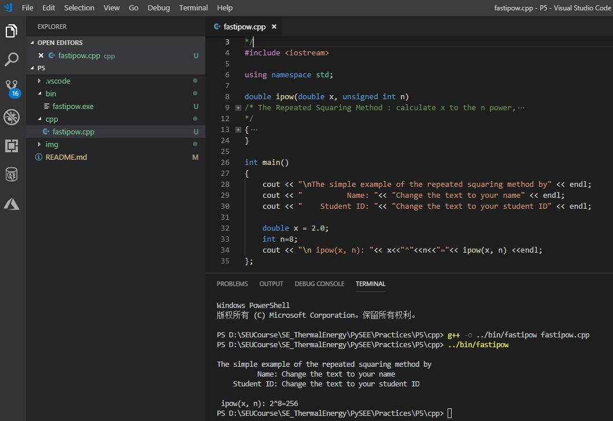

## Practice 5

**C/C++ Programming**(5)：C/C++ Programming with MinGW-w64（GCC)，MakeFile,the Shared Library

Deadline: 2019.06.09

## To Do(5 marks)：

The exponentiating by squaring is a general method for fast computation of large positive integer powers of a number.

https://en.wikipedia.org/wiki/Exponentiation_by_squaring

Please use the [fastipow.cpp](./src/fastipow.cpp) to program the following tasks:

* Source files(C/C++ code/header):(1.5 marks)

    *  The function of The Repeated Squaring Method

    *  The example application to call The Repeated Squaring Method

* Makefiles(3 marks)

    * Making the executable file with multiple source files: the function of The Repeated Squaring Method and it's caller

    * Making the shared library of the Repeated Squaring Method

    * Making the executable file to call the shared library 

* Images：(0.5 marks)

     * The screenshot of coding,making exe to use the shared library and running the  executable file
   
     Example:

   


```bash
 ├──<Practices>
 │   │ 
 │   |── <P5>
 │   │    │ 
 │   │    |── : screenshots of coding,making and running
 │   │    │ 
 │   │    |── <bin>: *.exe, *.dll
 │   │    |
 │   │    |── <src>: *.c,*.cpp, *.h
 │   │    |
 │   │    │── makefile:  building the executable file with multiple source files
 │   │    │ 
 │   │    │── makefile-dll: building the shared library 
 │   │    │               
 │   │    │── makefile-exe: building the executable file to call the shared library  
 │   │                   
```  

## Submission：

Compress your practice floder to ：**StudentNumber-Name-5.zip**

* 1 Email to：cmh@seu.edu.cn 
    
  * Subject：StudentNumber-Name-5
    
  * Attachment：**StudentNumber-Name-5.zip**

* 2 Deadline：2019.06.09

   * make up after deadline: points<=3 (2019.06.16)

* 3 Improvement: due：2019.06.16

## Reference

* [GCC_MAKE](http://nbviewer.ipython.org/github/PySEE/home/tree/S2019/notebook/Unit8-1-GCC_MAKE.ipynb)

* [GCC_DLL](http://nbviewer.ipython.org/github/PySEE/home/tree/S2019/notebook/Unit8-2-GCC_DLL.ipynb)

