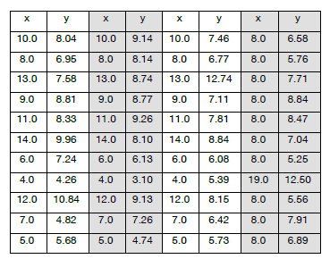

[](https://gitter.im/Py03013052/Students2016?utm_source=badge&utm_medium=badge&utm_campaign=pr-badge)

## 课程实践作业六

 数据分析：统计、回归及可视化,交互计算IPython Notebook  

## 推荐的工作

	03013315 朱彦祺*   03013304 黄怡婷*   03013306 谭美秀

	03013433 曾柯源*   03013409 范永学*

* 推荐的工作中有些是同学们在没有讲到有关内容时完成的（*），实践精神可嘉，

  但是程序成了“计算器”设计，从软件设计角度看，需要“重构”

  在"p6_demo.zip"已经给出后，不应再出现同类程序设计

### 问题：

16.4 Statistical Measures Don't, Tell the Whole Story

    In 1973, the statistician F.J. Anscombe published a paper containing the table below.

    It contains the <x, y> coordinates of the points in each of four data sets.

 

### 要求：

1. 四组数据的数据文件：纯文本格式或MS Excel表格；

2. 从数据文件读取数据，计算均值、方差和相关系数等统计指标

3. 对数据做线性回归

4. 绘制数据点图（含回归结果）

### 提交：

1. 文件压缩包：`学号_姓名_作业六.zip`；

2. 电邮：cmh@seu.edu.cn, 邮件主题：`学号_姓名_作业六`；

3. 推送到GitHub仓库。

### 提示：

参考课程IPython Notebook实现（第11、15章）

统计指标计算、回归分析: 可使用Python统计库 statistics、Numpy和Scipy

绘制数据点图: 使用Matplotlib.pyplot 

```python
import numpy as np
import matplotlib.pyplot as plt
from  statistics import mean,stdev,variance
```
